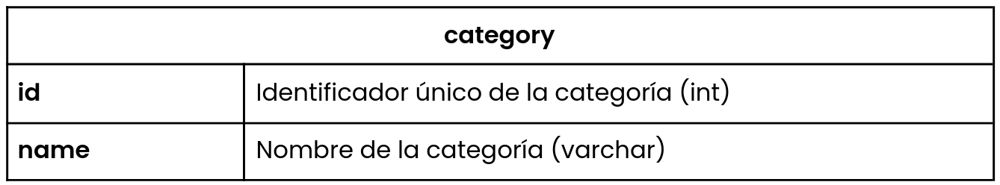
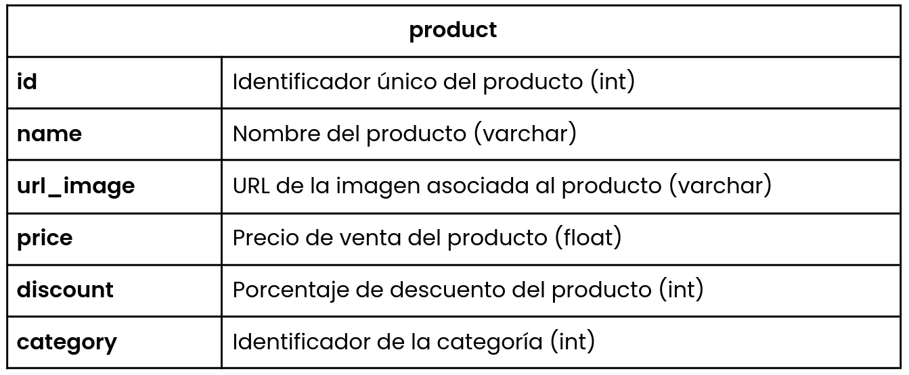
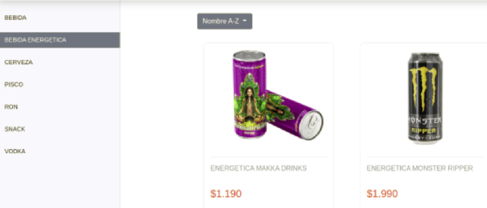
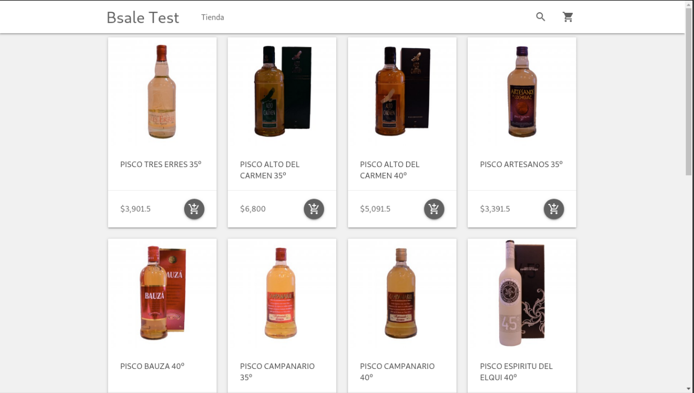
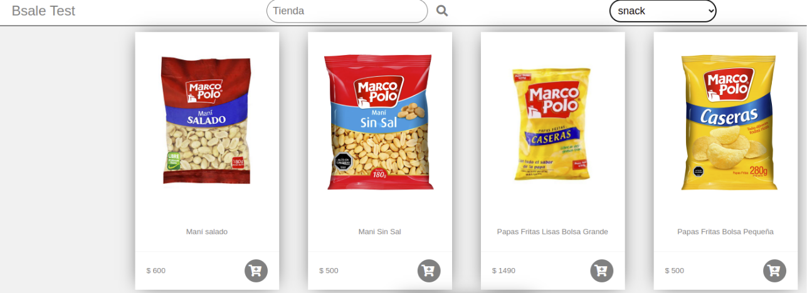
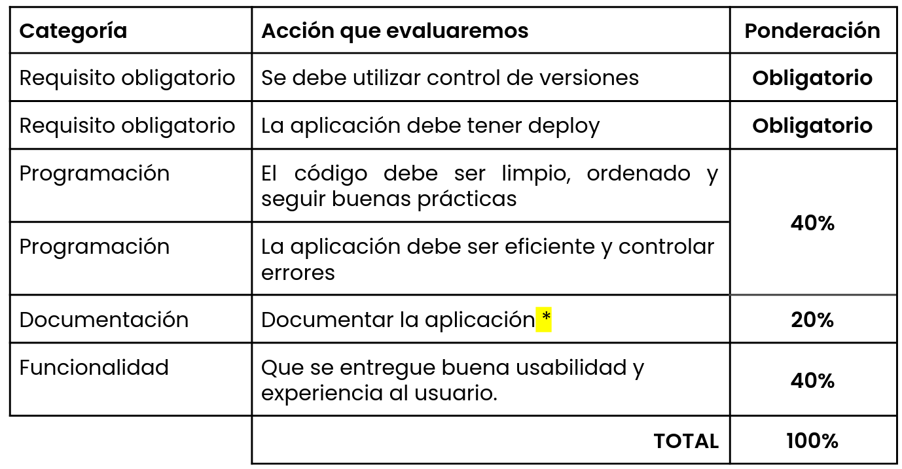

# DESAFÍO

## Objetivo

Determinar si el candidato está en condiciones de interactuar con una base de datos
a través de una aplicación web, implementando cliente y servidor.
Este ejercicio, no tiene ningún fin comercial ni estratégico, sólo queremos medir tus
habilidades...

## Ejercicio

Construir una tienda online que despliegue productos agrupados por la categoría a la que pertenecen, generando por separado backend (API REST) y frontend (aplicación que la consuma) y utilizando la base de datos que se disponibiliza para su desarrollo.

Además, hay que agregar un buscador, el cual **tiene que estar implementado a nivel de servidor**, mediante una Api Rest **\_cuyo lenguaje y framework puede ser de libre elección\_**. Es decir, los datos de productos deben llegar filtrados al cliente. Opcionalmente, puedes implementar filtros por atributo, ordenar productos y paginación.

La aplicación de cliente tiene que estar desarrollada con **\_vanilla javascript (javascript puro)\_**, **\_sin ningún framework\_**, si puedes usar librerías o componentes específicos, tales como; boopstrap, material, Jquery, entre otros. Finalmente, disponibilizar la aplicación y el repositorio con el código en un hosting como a modo de ejemplo, puede ser; Heroku, Netlity u otro. También puedes levantar el sitio en una cuenta AWS.

### Acceso a la base de datos de uso obligatorio

Base de datos

	● Motor: MySQL
	● Host: mdb-test.c 6 vunyturrl 6 .us-west- 1 .rds.amazonaws.com
	● Usuario: bsale_test
	● Contraseña: bsale_test
	● Nombre db: bsale_test

**Tip para la conexión** : El servidor está configurado para que todas aquellas
conexiones inactivas por más de 5 segundos sean abortadas, por lo que te
recomendamos utilizar alguna estrategia de “keep alive”

### Tablas

### Ejemplos de las imágenes que se encuentran en la BD**

# CONOCE LA PAUTA DE EVALUACIÓN

**¿Qué es documentar?** implica explicar ejercicio, Apirest, Frontend y Readme en
el repositorio de ambos proyectos (back y front).

Ejemplo de documentación:
https://apichile.bsalelab.com/lista-de-endpoints/productos-y-servicios/stocks

## Mucho éxito!!!